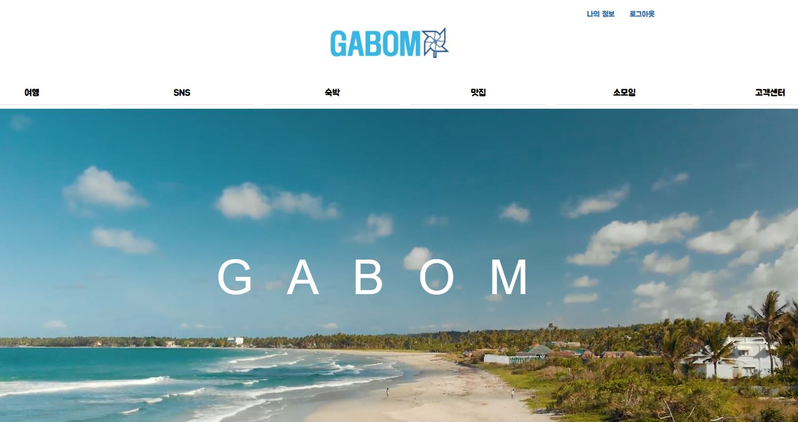
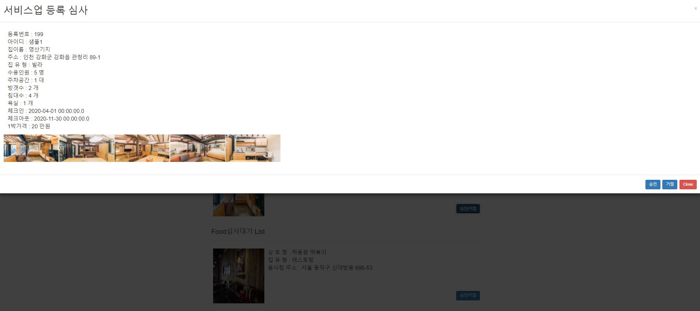
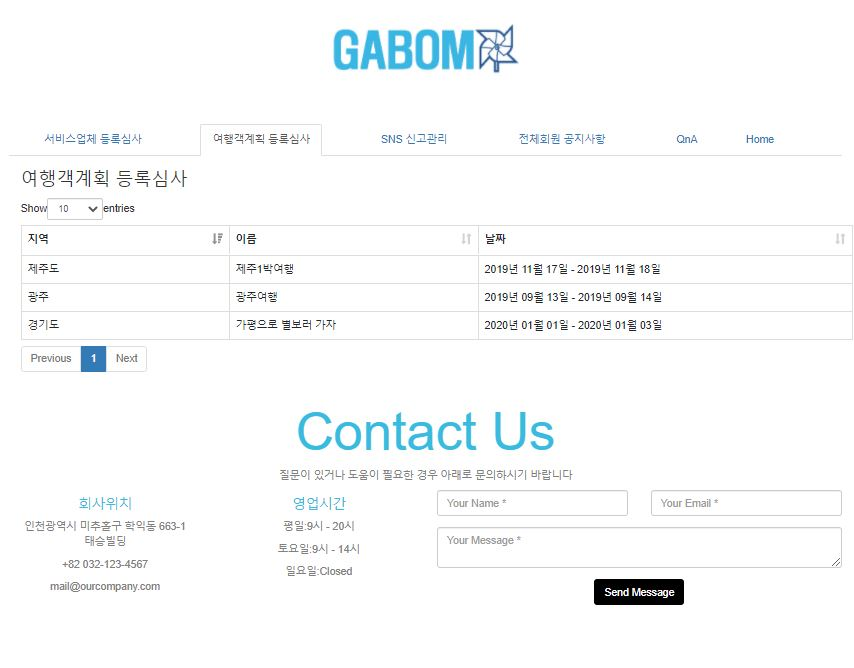

## 스프링으로 웹구현한 GABOM 프로젝트 입니다.
- 4인(하동원 - 조장, 이예상, 김성준, 마재환)
- 전반적인 아이디어, DB 설계, 비지니스로직 구현 등 포괄적인 업무를 담당 했습니다.

## 작품명과 소개
- GABOM (여행을 떠나다)
- 단순 예약이 아닌, 여행계획을 공유하고 숙박, 음식 그리고 SNS, 소모임 까지 할 수 있도록 구현한 복합 여행 플렛폼
- 담당 분야 : 소모임, 예약, 여행 공유 API 지도 구현, 공공데이터 API(여행장소), 채팅 등 구현

   
# 메인페이지 
-메인 페이지로써, 메뉴와 공유 여행계획 순위 리스트, 현재 예약된 숙소나 음식점 리스트가 보이며, 클릭시 이동됩니다.
 

|||||
| ------------------------------ | :----------------------------------: |:----------------------------------: |:----------------------------------: |
|  사진 |    |  |   |
|  내용 |    -Main page 입니다. |   -진엔 인기있는 여행계획 순위입니다 |   - 최근 예약한 숙소,음식점 리스트 입니다. |

   
# 숙박 plot.1 - 숙소 리스트
-계정은 두 종류가 있습니다, host 계정으로 가입한 유저는 관리자에게 GABOM 플렛폼에 자신의 숙소를 신청 할 수 있고, 관리자는 승인이나 거절 할 수 있습니다.
-승인이 될 경우, 해당 리스트에서 볼 수 있습니다.
 

|||||
| ------------------------------ | :----------------------------------: | :----------------------------------: | :----------------------------------: |
|  사진 |     |  | |
|  내용 |     숙박 가능한 숙소들 리스트 | 원하는 숙소 클릭 후 예약모습(기존에 예약된 날짜는 disable 처리) |  숙박한 사람들의 리뷰나 comment 모습|

   
# 숙박 plot.2 - 검색을 통한 숙소 리스트(with KAKAO 지도 API)
- 검색 키워드에 "제주"라고 검색할 경우, 제주에 관련 된 숙소 리스트가 나오며, 각 숙소의 위도, 경도에 따라 지도에 나타나게 됩니다.
 

||||
| ------------------------------ | :----------------------------------: | :----------------------------------: |
|  사진 |    |    |
|  내용 |      지역을 검색합니다. | 검색된 지역에 대한 숙소 리스트와 지도안에 마커로 표시했고, 마커에 포인트를 올리면 해당 숙소에 대한 사진이 나옵니다. |

   
# 숙박 plot.3 - 등록 외 숙소 리스트 검색 (with 크롤링, j-soup) 
- 현 플렛폼에 원하는 숙소가 없을 경우, 크롤러를 통해 호텔스컴바인에서 원하는 숙소 데이터를 가져옴
 

||||
| ------------------------------ | :----------------------------------: | :----------------------------------: |
|  사진 |    |    |
|  내용 |     지역과 날짜를 검색할 경우, 크롤러를 통해 호텔스컴바인의 데이터를 가져왔습니다.| 숙소 클릭시, 호텔스컴바인 홈페이지로 이동하게 됩니다.|

   
# 맛집 plot.1 - 숙박과 동일한 형태입니다.
 

||||
| ------------------------------ | :----------------------------------: | :----------------------------------: |
|  사진 |    |    |
|  내용 |   예약 가능한 맛집 리스트 | 예약과 리뷰 |

   
# 소모임 plot.1 첫화면
- 소모임을 만들 경우 방장이 될 수 있고, 방장은 정모를 만들 수 있으며, 유저를 관리 할 수 있습니다.
 

||||
| ------------------------------ | :----------------------------------: | :----------------------------------: |
|  사진 |    |    |
|  내용 |    검색과 소모임 만들 수 있습니다. | 가입한 소모임 리스트 입니다.|

   
# 소모임 plot.2 소모임 방(첫화면)
 

|||
| ------------------------------ | :----------------------------------: |
|  사진 |    |
|  내용 |    소모임 첫화면입니다, 방장은 정모를 만들 수 있으며, 공지, 게시글, 사진첩 메뉴 그리고 채팅이 있습니다. |

   
# 소모임 plot.3 정모(widt KAKAO API 지도, 다음 우편번호(주소-지번) API
- 방장은 위치, 날짜 등 내용을 기재하여 정모를 만들 수 가 있습니다.
- 소모임 맴버는 정모리스트 중 하나를 클릭하여, 정모 내용을 참고하여, 참석 여부를 결정 할 수 있습니다.
- 참석 리스트 클릭하며, 참석 승인을 한 맴버의 리스트를 볼 수 있습니다.
 

|||||
| ------------------------------ | :----------------------------------: | :----------------------------------: | :----------------------------------: |
|  사진 |     |  |  |
|  내용 |    정모를 만들기 위한 form 이며 지도API도 구현. | 만들어진 정모를 클릭하면 내용을 보는 화면. | 참석자 리스트.|

   
# 소모임 plot.4 게시판 & 앨범
- 게시판과 앨범은 비슷해서 게시판만 보여드리겠습니다.
- 게시판은 최대 사진3장, 글 등을 기재 할 수 있습니다.
- 게시글에는 좋아요, 댓글을 남길 수 있고 댓글이 많아 질 경우 PAGING 처리를 했습니다. 
 

|||||
| ------------------------------ | :----------------------------------: | :----------------------------------: | :----------------------------------: |
|  사진 |   |  | |
|  내용 |  게시판 리스트 입니다. | 게시판 작성 form |  해당 게시글에 대하여 좋아요, 댓글, 댓글 페이징 구현 |

   
# 소모임 plot.5 채팅(with socket)
- 소모임 맴버들 끼리 채팅을 할 수 있도록 구현했습니다.
- 스크롤을 올릴 경우, 과거 채팅내용을 볼 수 있도록 구현했습니다.
- 또한 카카오 채팅방 처럼, 해당 채팅이 언제 날짜로 되어 있는지 표시 나도록 했습니다.

 

|||
| ------------------------------ | :----------------------------------: |
|  사진 |      |
|  내용 |    채팅 GIF 입니다.   스크롤올리면 예전 채팅데이터를 가져오도록 구현했고   그 채팅데이터의 날짜도 볼수 있게 끔 구현했습니다 |

   
# 소모임 plot.6 알람(with socket)
- 방장이 정모를 만들 경우, 해당 소모임 맴버들 중 로그인 한 유저에게 알림이 가도록 구현했습니다.
- 알림을 클릭한 유저는 해당 소모임으로 페이지 이동하게 됩니다.
 

||||
| ------------------------------ | :----------------------------------: |  :----------------------------------: |
|  사진 |    |   |
|  내용 |    방장이 정모를 만들 때, | 정모 맴버들에게 알림이 가게됩니다.   알람 클릭시 해당 소모임으로 이동하게 됩니다.|

   
# 여행 plot. 1 메인
 

|||
| ------------------------------ | :----------------------------------: |
|  사진 |      |
|  내용 |    -여행계획을 만들거나, 추천여행보기에서 여행을 검색해서 저장 할 수 있습니다.|

   
# 여행 plot. 2 내 여행(with SOCKET)
- 상단에 [내여행]이라는 메뉴를 클릭 할 경우 나타납니다.
- 나의 여행 리스트이며, 삭제나 날짜를 수정 할 수 있습니다.
- 또한 친구들에게 여행계획에 초대를 신청 할 수 있고, 초대받은 친구는 좌측 메뉴를 통해 승인, 거절을 할 수 있습니다.
- 초대받은 친구는 그 순간 알람을 받게 되며, 클릭 시 이동하게 됩니다.
- 또한 여행 제목 옆에 버튼을 통해 공유계획을 신청 할 수 있습니다.
 

|||||
| ------------------------------ | :----------------------------------: |:----------------------------------: |:----------------------------------: |
|  사진 |    |  |   |
|  내용 |   - 내여행리스트, 같은 여행 맴버, 초대, 날짜 변경, 여행계획 삭제가 있습니다 |   -여행 계획 초대시, 초대된 사람은 알람창이 뜨고 클릭하면 여행페이지로 이동됩니다 |   - 좌측 메뉴에 요청 받은 계획에 승인, 거절을 할 수 있습니다. |

   
# 여행 plot. 3 특정 여행 계획 메인 페이지
- 여행계획 페이지입니다.
- 같이 여행 다닐 친구들과 같이 여행을 계획 할 수 있습니다.
- 채팅을 통해 쉽게 계획을 짤 수 있으며, 날짜마자 여행장소, 숙소를 추가하고, 경로도 변경 할 수 있으며, 메모를 다양한 정보를 기록 할 수 있습니다.
 

|||
| ------------------------------ | :----------------------------------: |
|  사진 |      |
|  내용 |    -특정 여행 계획 화면입니다. 여행 계획 순서를 변경가능하며, 변경 할때마다 지도가 변하도록 구현했습니다.  - 채팅을 통해 대화를 하며 친구들 끼리 쉽게 의사소통이 가능하도록 구현했습니다.   - 메모를 할 수 있으며, 여행 일짜마다 숙소를 예약하여 지도에도 추가 할 수 있습니다. |

   
# 여행 plot. 4 특정 여행 계획(with KAKAO 지도 API, SOCKET)
- 카카오 지도 API와 공공데이터 여행지 API를 통해 여행계획을 세웠습니다.
- 장소 추가나 숙소를 추가하면 해당 위도, 경도가 저장되면서 kakao 지도에 나타나도록 표시 했습니다.
 

|||||
| ------------------------------ | :----------------------------------: |:----------------------------------: |:----------------------------------: |
|  사진 |    |  |   |
|  내용 |    -하단에 장소 추가 버튼을 누를 경우 | -공공데이터API에서 가져온 여행지 리스트르 불러옵니다 | - 여행지를 선택해 추가를 할 경우, 해당 좌표가 추가가 되어 지도에 나타납니다. |

   
# 나의정보 plot.1 나의정보 수정, 나의 내역
- 나의 프로필 사진, 개인 정보를 변경 할 수 있습니다.
- 숙소에 리뷰를 남길 수 있습니다.
- 예약리스트, 게시물, 좋아요, 댓글 등 모든 기록을 확인 할 수 있습니다.
 

|||||
| ------------------------------ | :----------------------------------: |:----------------------------------: |:----------------------------------: |
|  사진 |    |  |   |
|  내용 |  나의정보 메인페이지 |   리뷰 내역 | GABOM 플랫폼 활동 내역 |

   
# 관리자 plot.1 서비스업체 등록 심사
- 관리자는 숙소, 맛집에 대한 신청을 평가하여 승인 혹은 거절 할 수 있습니다
 

||||
| ------------------------------ | :----------------------------------: |:----------------------------------: |
|  사진 |    |  | 
|  내용 |    신청된 숙소의 리스트 |   숙소에 대한 상세 정보 |  

   
# 관리자 plot.2 여행계획 공유 심사(with KAKAO 지도 API)
- 관리자는 여행계획에 대한 신청을 평가하여 승인 혹은 거절 할 수 있습니다
 

||||
| ------------------------------ | :----------------------------------: |:----------------------------------: |
|  사진 |    |  | 
|  내용 |   신청된 여행계획의 리스트 |   여행계획의 상세 정보 |  

   
# 관리자 plot.3 전체회원 공지사항(with Socket), QnA
- 관리자는 공지사항에 글을 올려 전체 유저에게 알람을 줄 수 있습니다.
- 사용자들이 QnA에 질문을 할 경우, 댓글을 달 수 있습니다.
 

||||
| ------------------------------ | :----------------------------------: |:----------------------------------: |
|  사진 |    |  | 
|  내용 |    공지사항 |   QnA 답변 |  

