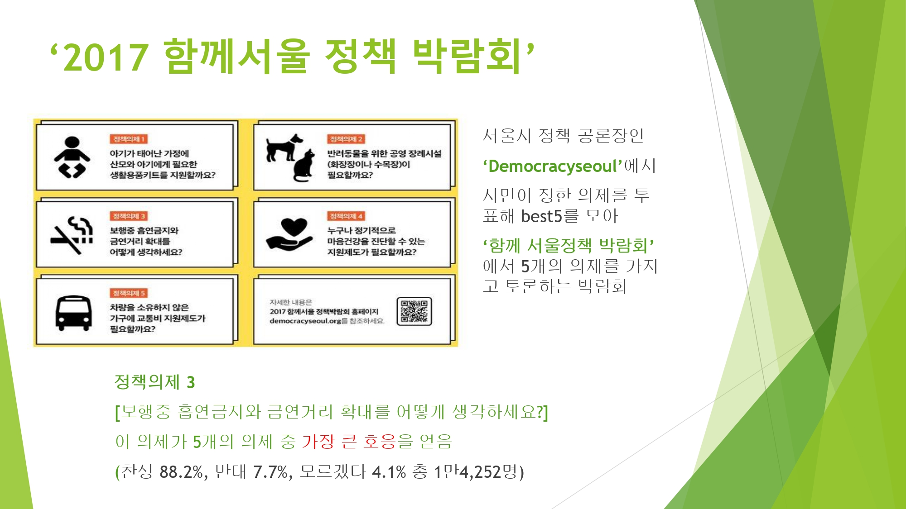

## 개요

파이썬 beautifulsoup, selenium을 통해 서울시 민원 사이트인 '서울시 응답소'를 크롤링 하여
통계를 내어 어던 민원들이 있는지 살펴보았고, 그 중 흡연에 대해서 어떠한 문제가 있고
그에 따른 해결방안을 강구해보고자함

## 소감
빅데이터 시대인 만큼 많은 데이터를 모으는 방법 중 하나인 크롤러를 써봤습니다.
지금은 단순한 프로젝트이지만 크롤러와 통계를 통해, 어떠한 문제점을 발견하고 
해결방안을 강구할 수 있다는 점에서 매우 의미가 깊었습니다.
다음 소프트의 송길영님의 강의에서 했던
말들이 너무 공감갔습니다. 

   

   

## 서울시 응답소 입니다.
- 민원 사례중 최근 3년치 크롤러를 했습니다.

   

## 크롤러로 모은 데이터의 단어 빈도수 입니다(R로 구현했습니다)

   

## 단어 통계 입니다. 몇가지 단어들을 소거하여, 최종적인 빈도를 산출했습니다.
- 여기서 '흡연'에 대해 더 자세히 볼 생각입니다.

   

## '흡연'을 포함한 문장들을 모아 분석해본 결과입니다.
- 구역, 버스, 주변 등 공공장소 키워드와 아이, 주민, 우리 등 흡연에 따른 간접피해가 사료되는 키워드들이 많았습니다.

   

## 소셜 메트릭스를 통한 버즈량(단어 노출량)을 본 결과
-간접흡연, 흡연구역에 대한 버즈량은 꾸준히 증가 했고, 길빵이란 단어도 새로 등장 하기 시작했습니다.

   

## 소셜 메트릭스를 통한 버즈량(단어 노출량)을 본 결과
- 또한 SNS를 통해 금연구역에 흡연으로 인한 비흡연자의 불만과
- 흡연구역이 부족함에 따른 흡연자들의 불만을 파악할 수 있었습니다.

   

## word Cloud 와 social matrix를 통한 정리 입니다.

   

## 국민건강증진법에 있는 금연,흡연 구역에 따른 법 조항입니다.

   

## 공공데이터 기반으로한 서울시 안에 있는 금연, 흡연 구역에 대한 위치 입니다.
- 금연 구역이 압도적으로 많습니다.

   

## 2차 사례

   

   

# 해결방안

   

# 프로젝트 아키텍쳐

